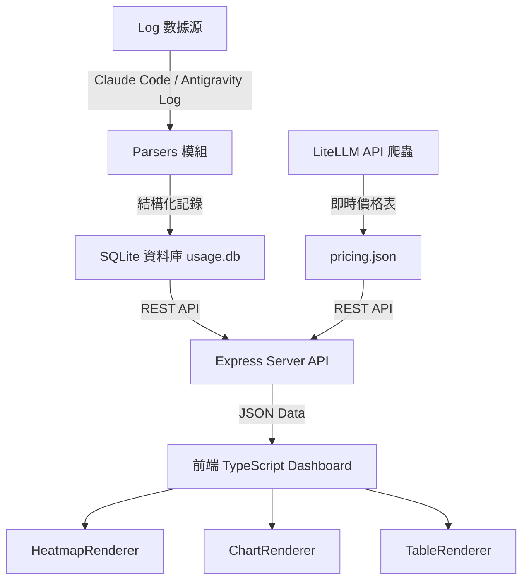

# Vibe Coding Usage - 系統架構與開發設計文件 (System Architecture & Agent Guide)

本文件旨在為後續參與開發的 AI Agent 與人類開發者提供系統架構、資料流程、設計規範與擴充指南。

---

## 📐 1. 系統整體架構 (Overall Architecture)



### 系統主要層級說明：
1. **Log Data Source & Parsers (`src/parsers/`)**: 解析本地端 AI 工具產生的日誌（支持 Incremental Parsing 增量解析）。
2. **Database & Backup Layer (`src/db.ts`, `src/backup.ts`)**: 持久化資料庫存儲，資料最小粒度為「小時 (Hour)」。自動備份原始日誌檔至指定路徑。
3. **Price Management (`src/pricing-fetcher.ts`)**: 自動同步並轉譯模型 API 價格，支援未知模型動態填補。
4. **Server API (`src/server.ts`)**: 提供過濾查詢、數據統計、同步與設定介面。
5. **Frontend Core (`public/js/`)**: 純 TypeScript 撰寫，無大型前端框架依賴，極致輕量與快速 response。

---

## 🗄 2. 資料庫 Schema & 資料流

### Primary Table: `usage`
主鍵設計為複合主鍵，確保最小時間單位（小時）與各維度聚合之唯一性與增量更新能力：
```sql
CREATE TABLE IF NOT EXISTS usage (
    date TEXT NOT NULL,          -- YYYY-MM-DD
    hour INTEGER NOT NULL,       -- 0-23
    platform TEXT NOT NULL,      -- claude-code / antigravity
    profile TEXT NOT NULL,       -- personal / work / default 等
    type TEXT NOT NULL,         -- input / output / cache_write / cache_read
    model TEXT NOT NULL,         -- 原始模型名稱 (e.g. claude-3-5-sonnet-20241022)
    project TEXT NOT NULL,       -- 專案絕對路徑
    session TEXT NOT NULL,       -- 對話/Session ID
    tokens INTEGER NOT NULL,     -- 累積 Tokens 數
    PRIMARY KEY (date, hour, platform, profile, type, model, project, session)
);
```

---

## 🔍 3. Parsers 解析邏輯

### 3.1 Claude Code Parser (`src/parsers/claude-code.ts`)
- **掃描標的**: 讀取使用者設定檔中的 Claude Log 目錄 (如 `~/.claude`, `~/.claude-work`)。
- **目標檔案**: `projects/**/*.jsonl` 與 `conversations/*.jsonl`。
- **數據提取**: 解析每筆記錄中的 `type`, `message.model`, `usage.input_tokens`, `usage.output_tokens`, `usage.cache_creation_input_tokens`, `usage.cache_read_input_tokens`。

### 3.2 Antigravity Parser (`src/parsers/antigravity.ts`)
- **掃描標的**: 讀取 `~/.gemini/antigravity/brain/`。
- **目標檔案**: 各 Session 的 `logs/transcript.jsonl` 與 `transcript_full.jsonl`。
- **數據提取**: 針對 Google Antigravity 代理人對話軌跡，提取模型 Token 消耗數據。

---

## 📊 4. 前端模組設計與核心邏輯 (Frontend Architecture)

前端採用 **Orchestrator 模式**，由 `App.ts` 統一調度 `FilterManager`, `HeatmapRenderer`, `ChartRenderer` 與 `TableRenderer`。

```
public/js/
├── app.ts            # 主控邏輯 (Orchestrator)
├── filters.ts        # 2-Row Layout 過濾器 (Profile/Platform/Project/Model/Type/Date)
├── heatmap.ts        # Usage Heatmap (Daily / Hourly 8x3 矩陣)
├── charts.ts         # Usage Trends (階層色系/模型動態彩度/Project Top 7色系)
├── table.ts          # Detailed Data Table (Tokens/Dollars/% 切換, Expand Path, 獨立 Scrollbar)
├── types.ts          # 前端 TypeScript 介面定義
└── utils.ts          # 數值格式化工具 (K, M, G 縮寫)
```

### 4.1 UI 與互動邏輯特點 (User Preferences & Conventions)
1. **「不選 = 全選」與獨立單位**:
   - 任何過濾條件如果不勾選/不選擇，邏輯上視為「不限制（全選）」。
   - **Unit 單位選擇**（Tokens / Dollars / %）完全獨立於過濾器之外，按下即可全域即時生效。
2. **Usage Heatmap**:
   - **左側標題單位切換**: 於標題列左側 (`<h2>` 旁) 提供 `Tokens` / `Dollars` 開關，切換熱點圖以 Token 總量或折合金額進行顏色階階與數值繪製。
   - **Daily 模式**: 週一到週日全顯示 (Mon~Sun)，色階以當月用量進行動態縮放。
   - **Hourly 模式**: 採 **由上而下 -> 由左到右** 排列（即單日分成 3 個直欄，每欄 8 小時：Column 1 包含 0~7 小時，Column 2 包含 8~15 小時，Column 3 包含 16~23 小時）。
   - **Hover Card**: 滑鼠懸停格子時顯示詳細小時/日期統計與各類 Token 消耗與花費。
3. **Usage Trends (趨勢長條圖)**:
   - **左側標題單位切換**: 於標題列左側 (`<h2>` 旁) 提供獨立的 `Tokens` / `Dollars` 開關，可即時切換長條圖與 Y 軸為 Token 總量或折合美金金額。
   - **Model 階層色系與動態彩度 (Chroma)**:
     - 家族順序: `Claude Fable (紅)` > `Claude Opus (橘)` > `Claude Sonnet (黃)` > `Claude Haiku (黃綠)` > `Gemini (藍)`。
     - 家族內依照版號/使用量自動計算彩度與亮度，數字/使用量越大彩度越高。
   - **Profile/Platform 色系**:
     - `Claude Code` 採橘色系，`Antigravity` 採藍色系。
   - **By Project 色系與排序**:
     - 依據 Filter 範圍內總使用量排序。
     - **Top 1~7 專案**: 採用高對比度的 7 種鮮豔色彩。
     - **Top 8 以後專案**: 採用低彩度/較暗的顏色，避免圖表視覺混亂。
4. **Detailed Data Table (詳細數據表格)**:
   - **雙切換開關 (Dual Toggles)**: 均配置於標題列左側 (`<h2>` 旁)。
     - 第一組開關: `Tokens` / `Dollars` (選擇呈現 Token 數量或美金金額)。
     - 第二組開關: `Value` / `%` (選擇呈現絕對數值或佔比百分比，精確至 0.01%)。
   - **Primary 與 Detail 雙維度下拉選單**:
     - `Primary Group`: 主分組依據 (如 By Model, By Project, By Session, By Platform, By Profile, By Date)。
     - `Detail By`: 次維度展開依據 (支援任意切換)。
   - **樹狀細節展開 (Tree / Drill-Down Sub-rows)**:
     - 點擊主列任意位置或展開箭頭 `▶`，即可就地展開子列 (`.sub-row`)，依 `Detail By` 細分呈現各子項目之 Input, Output, Cache, Total, Hit Rate 及 Cost。
   - **By Project 縮寫**: 預設僅顯示專案路徑的最後一格資料夾名稱（工作根目錄），並提供 `Expand Path` 按鈕可一鍵展開完整絕對路徑。
   - **獨立垂直捲軸**: 表格的高度限制在大約 5 行資料，並且捲軸只會呈現在 `<tbody>` 區塊，頂部的 Header 與底部的 TOTAL 列皆採用實心背景 (`var(--bg-dark)`)，滑動時不透光且不被捲軸擠壓。

---

## 🛠 5. Agent 開發者擴充指南 (Extension Guide for Future Agents)

### 5.1 如何新增一個全新的 AI 工具 Log Parser？
1. 在 `src/parsers/` 下建立新的解析器類別 (繼承或參考 `src/parsers/base.ts`)。
2. 實作 `parse()` 方法，傳回 `UsageRecord[]` 陣列。
3. 在 `src/db.ts` 的 `syncLogs()` 邏輯中註冊新的 Parser。
4. 在 `config.json` 中配置該工具的預設 Log 路徑與 Platform 名稱。

### 5.2 如何調整模型價格與計費邏輯？
- 系統已內建自動爬蟲 (`src/pricing-fetcher.ts`)，伺服器啟動時會定期向 LiteLLM 獲取最新的 Open-Source 價格表。
- 若有特殊模型需手動指定價格，可以直接修改 `pricing.json`。格式如下：
  ```json
  "model-name": {
    "input_cost_per_token": 0.000003,
    "output_cost_per_token": 0.000015,
    "cache_write_cost_per_token": 0.00000375,
    "cache_read_cost_per_token": 0.0000003
  }
  ```

---

## 📝 6. 維護紀錄與歷史變更 Summary
- **v0.1**: 完成基礎架構、SQLite 存儲、Claude Code 與 Antigravity Log 解析器。
- **v0.2**: 新增 Hourly Heatmap 8x3 排列、Daily/Hourly 切換、LiteLLM 價格自動爬蟲。
- **v0.3**: Filter Layout 重構為 2-Row 簡潔排版；趨勢圖新增模型家族/Profile/Project 階層色彩與動態彩度排序。
- **v0.4**: Data Table 新增 `%` 單位支援、By Project 專案路徑展開/折疊功能，以及獨立 `tbody` 捲軸優化。
- **v0.5**: 為 Usage Heatmap、Usage Trends 與 Detailed Data Table 提供獨立的 `Tokens / Dollars` 切換開關，並將 Table `%` 拆分為獨立的 `Value / %` 切換開關；建立 `config.example.json` 與安全 `.gitignore` 設定。
- **v0.6**: 
  - **視覺化設定視窗**: 具備左側搜尋與分類側欄、路徑設定及可動態增刪修改的資料來源表格。
  - **自動啟動配置 (Zero-Config First Run)**: 啟動時自動探測本機預設路徑生成草稿，首次進入直接跳出設定頁面，確認後再初始化寫入檔案。
  - **Data Table 雙維度 Drill-Down**: 支援次維度選擇 (`Detail By`) 與點擊展開子項目即時計算呈現。

