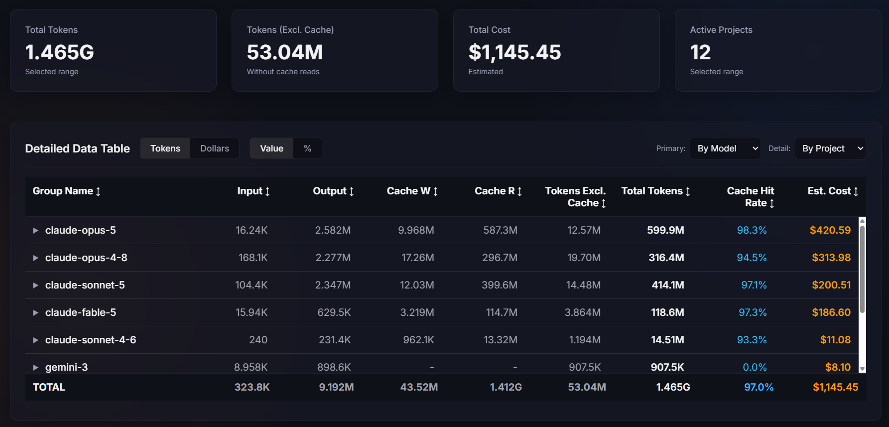
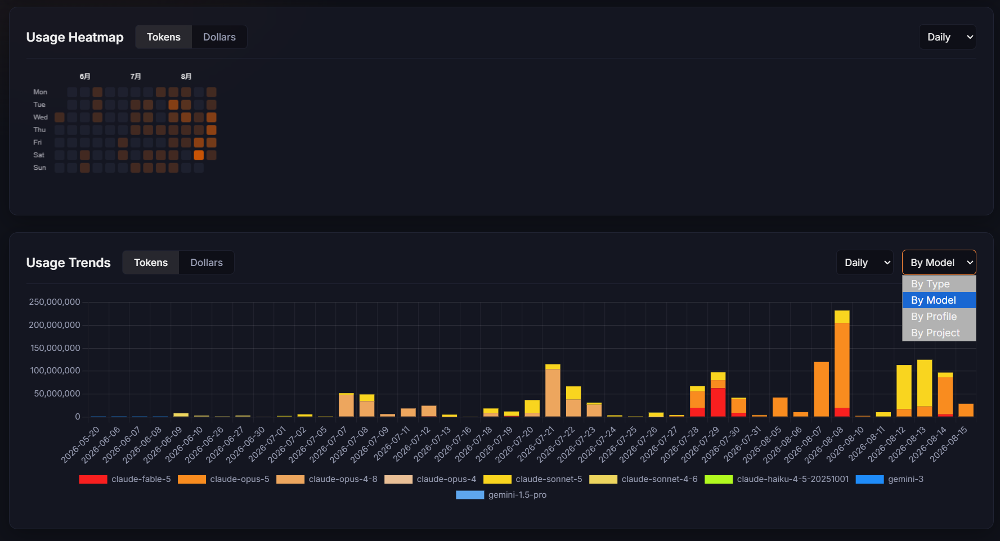

# Vibe Coding Usage

一個在本機執行的儀表板，用來統計 AI 程式碼助手的 Token 使用量與估算花費。它會讀取 **Claude Code** 與 **Google Antigravity (Gemini)** 寫在本機的 log，整理成 SQLite 資料庫後以網頁呈現。

<table>
  <tr>
    <td width="50%"></td>
    <td width="50%"></td>
  </tr>
  <tr>
    <td align="center"><sub>總覽數據卡與 Detailed Data Table</sub></td>
    <td align="center"><sub>Usage Heatmap 與 Usage Trends</sub></td>
  </tr>
</table>

## 功能

### Log 解析

- **Claude Code**：掃描設定目錄下的 `projects/**/*.jsonl`，讀取每則 assistant 訊息的 `usage` 欄位，取得 input / output / cache write / cache read 的實際 token 數。若你另外建了多個 Claude 目錄（例如 `.claude-work`），可在設定畫面加為額外來源，並以 profile 區分統計。
- **Antigravity**：掃描 `brain/<session>/.system_generated/logs/transcript.jsonl`。
- 採增量解析，記錄每個檔案已讀取的 offset，重複執行不會重複計算。
- Parser 以介面方式定義（`src/parsers/base.ts`），要新增其他工具的支援不難。

> **關於 Antigravity 的數字**：Antigravity 的 log 沒有記錄 token 數，本工具是用 `字元數 ÷ 4` 推估，並標記為 estimated。它只有 input / output 兩類，沒有 cache，模型名稱也只能從設定變更事件推斷（推斷不到時記為 `gemini`）。**這部分的數字僅供粗略參考，不適合拿來對帳。** Claude Code 的數字則是 log 中的實際值。

### 儀表板

- **Usage Heatmap**：`Daily` 以週一到週日排列；`Hourly` 每天分成 3 欄、每欄 8 小時。顯示範圍依照目前篩選結果的資料起訖日期自動決定。可切換 `Tokens` / `Dollars`，滑鼠懸停顯示該格的各類 token 與花費。
- **Usage Trends**：長條圖，可依 `Type`、`Model`、`Profile`、`Project` 分組。模型依家族配色（Fable 紅 → Opus 橘 → Sonnet 黃 → Haiku 黃綠, Gemini 藍），家族內依用量調整彩度；專案則取用量前 7 名給高對比色，其餘用低彩度以免圖表雜亂。
- **Detailed Data Table**：可選 `Primary Group` 與 `Detail By` 兩層維度，點資料列即可就地展開子項。提供 `Tokens / Dollars` 與 `Value / %` 兩組切換。專案欄預設只顯示最後一層資料夾名稱，可按 `Expand Path` 展開完整路徑。
- **篩選器**：時間範圍、平台 / Profile、專案、模型、類別。未選取的條件視為不限制。

### 設定與資料

- 首次啟動若找不到 `config.json`，會依作業系統的使用者目錄探測工具本身會建立的路徑（`.claude`、`.gemini/antigravity`、`.gemini`），把存在的那些列為草稿，開啟前端時跳出設定畫面讓你確認後再寫入。自建的額外目錄請在設定畫面自行新增。
- 設定畫面可修改備份路徑、資料庫路徑，以及新增 / 刪除 / 修改資料來源。
- 啟動時會把來源 log 目錄複製一份到設定的備份路徑。
- 價格資料存在 `pricing.json`。啟動時若發現資料庫裡有 `pricing.json` 沒收錄的模型，會向 [LiteLLM 的價格表](https://github.com/BerriAI/litellm/blob/main/model_prices_and_context_window.json) 查詢並補上；查不到的會套用一組保守的預設值。已存在的價格不會被覆蓋，需要調整請直接編輯 `pricing.json`。

## 安裝與啟動

需要 Node.js 18 以上（`better-sqlite3` 需要對應的 prebuilt binary 或本機編譯環境）。

```bash
npm install
npm run dev
```

開啟 `http://localhost:3000`。首次啟動會跳出設定畫面，確認路徑後即會開始同步；之後可從右上角 **Settings** 修改。

正式建置：

```bash
npm run build
npm start
```

## 技術棧

- 後端：Node.js、Express、better-sqlite3
- 前端：原生 TypeScript（無框架）、Chart.js、Canvas
- 建置：esbuild、tsx

> Chart.js 與 Inter 字型是透過 CDN 載入，因此首次開啟頁面需要連上網路。資料本身則完全留在本機，不會外傳。

## 專案結構

```
src/              Express 伺服器、SQLite 存取、備份與價格查詢
src/parsers/      各平台的 log 解析器
public/           前端 HTML / CSS
public/js/        前端 TypeScript（UI、圖表、篩選器、表格）
config.json       個人設定（不納入版控，可參考 config.example.json）
usage.db          SQLite 資料庫，預設產生於專案根目錄
```

## 架構文件

資料庫 schema、parser 細節、前端模組劃分與配色規範，請見 [ARCHITECTURE.md](ARCHITECTURE.md)。

## 授權

[MIT](LICENSE)
